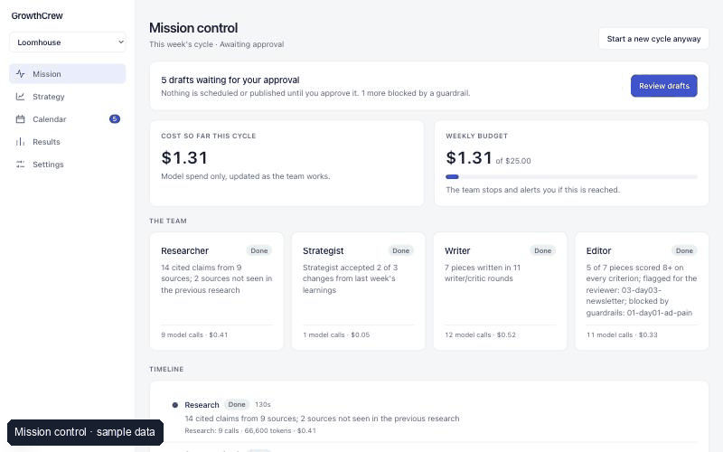
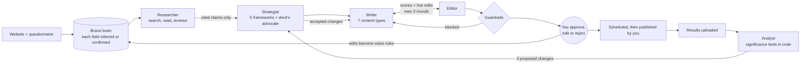

# GrowthCrew

**An AI marketing team for small businesses, where a human approves every output.**



Five agents research the market, set the strategy, write the content, edit it and read the
results. You approve, edit or reject each draft, usually from your phone. Each week the
analyst proposes changes, the strategist rules on them, and next week's plan shifts.

> **Status, plainly.** The system is built and tested (255 tests, 91% coverage, offline evals
> and all 39 red-team attacks passing, a 20-workspace load test on Postgres with no
> cross-tenant writes). It has **not yet run against the live model or for a real business**:
> every screenshot uses a sample brand with invented data. Pilot results and cost per piece
> are **not yet measured**.

## The problem

A small business owner does marketing in the gaps between everything else. Agencies are priced
for bigger companies, freelancers need briefing and managing, and a chat assistant produces
plausible copy with no strategy behind it, no memory of what worked, and no check on whether
the "92% of customers" it just wrote is true.

The owner does not need more words. They need a team that knows the business, argues from
evidence, learns from results, and never publishes anything they have not seen.

## How it works



It also remembers. Every measured piece goes into a content memory; a weekly job looks for
patterns that keep holding and retires the ones that stop; and the writer is shown the brand's
own past winners before each draft. Retrieval uses a lexical embedder (it matches shared wording and
topic vocabulary, not meaning); pgvector storage is in place for a model-backed embedder.

**The loop that matters** is the bottom one: results come back, the analyst proposes three
changes, the strategist accepts or rejects each with a reason, and accepted changes alter next
week's content plan. Every ruling is kept in a learning log.

## What v2 adds

- **Always-on research**: competitor page diffs, Search Console gaps, social listening, and a
  Signals inbox a person sends findings from. Every finding cites a URL and a date.
- **Visual creative**: brand-kit templates rendered in three sizes by a sandboxed Chromium,
  measured accessibility checks that cap a vision critic, landing page variants.
- **Synthetic audience panel**: evidence-backed personas that may suggest dropping a weak
  variant, never pick a winner, and stay silent until calibrated against real verdicts.
- **Live data and MCP**: encrypted read-only connectors (Search Console, GA4, Brevo, HubSpot),
  and GrowthCrew served as an MCP server whose only write needs a single-use human token.
- **Evals v2**: a 75-request golden set, a position-swapped pairwise judge, 39 red-team
  attacks, per-cycle tracing and a CI gate against a baseline.
- **Production backbone**: Postgres + pgvector, a durable job queue, tenant scoping, roles,
  a hash-chained audit log and a kill switch.
- **Product UX**: approve from Slack or a signed, single-use email link; live mission stream
  and week replay; keyboard review with tracked changes; a read-only demo login.
- **MixLab connection**: the strategist checks its budget split against a marketing-mix
  model's interval and sends final test verdicts back as calibration (demo is synthetic).

## What it refuses to do

The model writes; code decides what is allowed through.

| It will not | How that is enforced |
|---|---|
| Publish anything | Every draft is created `pending_approval`. One function guards scheduling, export and publishing, and requires a named human's approval. |
| Use an invented statistic or testimonial | A number or quote that is not in the brand's own proof caps the editor's accuracy score and blocks the draft. |
| Make an uncited claim about a competitor or market | Research claims whose URL the agent never read are deleted. Customer quotes must be verbatim. |
| Call a winner early, or on a cherry-picked metric | Tests are pre-registered and judged once, at their planned sample, on their registered metric, by a Bayesian rule (see [docs/experiments.md](docs/experiments.md)). |
| Accept a winner that hurts a guardrail | A winner that damages cost per click or unsubscribe rate is held for a person. |
| Treat a guess as a fact | Every brain field is `inferred` until you confirm it, and agents see that tag. |
| Overspend | A weekly cap per workspace and an optional total cap, checked before every model request. |

## Eval scorecard

From `make eval` (offline; no API key). Full output in `evals/results/scorecard.md`.

| Eval | Result |
|---|---|
| Experiment engine: false winners between identical variants | 4.4% at worst across five scenarios, 2,000 simulated tests each |
| Experiment engine: right winner at the planned sample | 76 to 78% of 1,000 tests; wrong winner in none |
| Experiment engine: calls a winner on a tiny sample | 0 of 200 |
| Pattern miner, 12 simulated weeks x 20 seeds | Real pattern active at week 12 in 20 of 20; the one that stopped holding was out of use in 20 of 20 (retired in 19) |
| Bandit against an even budget split | 61% fewer clicks given up over 8 simulated weeks |
| Analyst: simulated weeks, end to end through CSV ingest | 10 of 10 correct |
| Guardrails: labelled cases | 28 of 28 (every must-block line blocked, no false blocks) |
| Golden set (3 brands x 25 requests, 21 hard cases) | Built; 0 of 75 human reference outputs written yet |
| Judge calibration against 20 human scores | Pieces ready; 0 of 20 human scores yet |
| Strategy, content and research evals | Written; need the live model (`make eval-live`) |
| Red team (prompt injection, invented proof, defamation, auto-publish, budget) | 39 of 39 attacks fail as they should |
| Load test: 20 workspaces, 6 workers, Postgres, simulated model | 20 of 20 cycles in 13.8 s, 0 dead jobs, 0 cross-tenant drafts |

## Pilot results

**None yet.** A 60-day pilot kit is built (`growthcrew pilot init`): a 30-day baseline, a plan,
a weekly ritual, a tracker, and day-30 and day-60 reports. When a pilot has run, this section
will show, against baseline: followers, impressions, engagement rate, sessions from social,
leads, email reply rate and the owner's hours per week.

The reports are before/after comparisons, not experiments, and say so on the first screen.
Each one lists what else happened in the period and flags any count under 30 as too small to
interpret.

## Cost per piece

**Not measured yet.** Every model call is logged with tokens and cost, and tagged with the
piece it was for, so the dashboard at `/costs/dashboard` will show cost per agent, per piece
and per week once the system has run. It makes no freelancer comparison until you enter quotes
you have actually received.

## Run it

With Docker (not yet tested on a machine with Docker installed):

```bash
docker compose up --build
```

Then open http://localhost:3000 and use the demo login button. Without an `ANTHROPIC_API_KEY`
the app runs on the sample brand and model actions return a clear "no key configured" message.

Without Docker:

```bash
uv sync
uv run python -m evals.demo_seed          # sample brand and a local demo login
uv run uvicorn growthcrew.api.main:app --port 8000
cd web && npm install && npm run dev      # http://localhost:3000
```

To run the agents for real, copy `.env.example` to `.env`, add `ANTHROPIC_API_KEY` (and a
Brave Search key as `SEARCH_API_KEY`), then:

```bash
uv run growthcrew onboard --url https://your-business.com
uv run growthcrew cycle your-business
```

There is also a read-only Streamlit demo of the sample brand, for hosting on Streamlit
Community Cloud: `uv run streamlit run streamlit_app.py`.

Checks: `make lint`, `make test`, `make eval`. `render.yaml` is a deploy blueprint for a public
demo with a spending cap; it has not been deployed.

## Limitations

- **Unproven in the wild.** No live model run and no real business yet. Prompts that pass with
  a scripted test model may need work with the real one.
- **Publishing is mostly manual.** Approved Brevo newsletters can be sent; social posts are
  copied and marked published by a person.
- **Connectors are tested on recorded fixtures**, not yet against a real client account.
- **Guardrails are pattern rules.** They catch listed phrasings, not every rewording.
- **The judge and the panel are uncalibrated** until human scores and final verdicts exist.
- **Lexical memory search.** Past pieces are matched on shared wording, not meaning.
- **One look per test.** The experiment engine cannot stop a test early; see the roadmap.
- **The load test simulates the model**, so it measures the backbone, not model latency.
- **The usability test is scripted but not run** ([docs/usability_test.md](docs/usability_test.md)).

## Roadmap

See [docs/roadmap.md](docs/roadmap.md). Next: run every agent against the live model, a real
60-day pilot, a model-backed embedder on pgvector, and sequential stopping for low-traffic tests.

## Repo map

| Path | What is there |
|---|---|
| `src/growthcrew/agents/` | Researcher, strategist, writer, editor, analyst, orchestrator |
| `src/growthcrew/brain/` | Brand knowledge base, onboarding, voice learning |
| `src/growthcrew/frameworks/` | Positioning, jobs-to-be-done, messaging house, funnel, test-and-learn |
| `src/growthcrew/analytics/` | CSV ingest and the statistics |
| `src/growthcrew/guardrails.py`, `workflow.py`, `budget.py` | What is blocked, who approves, what it may spend |
| `evals/` | Golden set, judge, eval suites, scorecard runner |
| `web/` | Next.js app: onboarding, mission control, strategy, calendar, results, settings |
| `src/growthcrew/monitor/`, `creative/`, `panel/`, `connectors/` | Always-on research, visual creative, synthetic panel, live data |
| `jobs.py`, `tenancy.py`, `audit.py`, `approvals.py` | Queue, tenant scoping, audit log, Slack and email approvals |
| `docs/` | [Case study v2](docs/case_study_v2.md), [blog post](docs/blog_post.md), [MixLab](docs/mixlab.md), [operations](docs/operations.md), [Architecture](docs/architecture.md), [experiments](docs/experiments.md), [roadmap](docs/roadmap.md), [case study](docs/case_study.md), [launch copy](docs/launch.md), [self-review](docs/review.md) |
