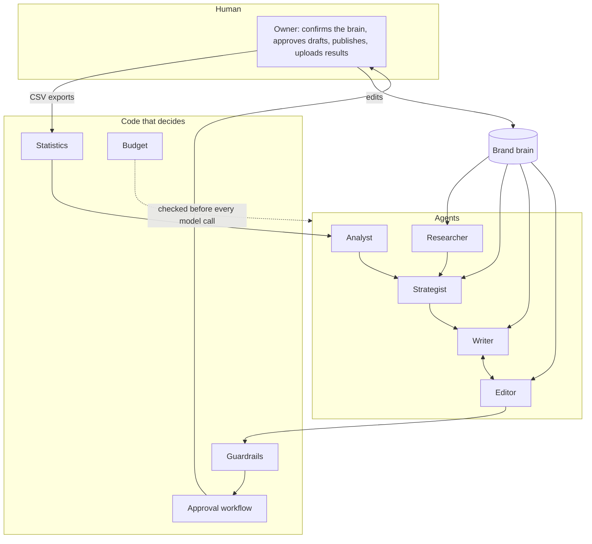

# Architecture

How GrowthCrew is put together: the agents, how data moves between them, and where it is kept.
For the reasons behind the design, see the [case study](case_study.md).

## The shape of it



One rule runs through all of it: **the model writes, and code decides what is allowed
through.** Every agent returns structured output validated against a schema, and each rule that
matters is enforced after the model has answered, not requested in a prompt.

## Agents

All agents call the model through one module, `llm.py`, which retries, validates the output
against a pydantic schema, checks the budget, and logs tokens and cost.

| Agent | Module | Reads | Produces | Rules enforced in code |
|---|---|---|---|---|
| Onboarding | `brain/onboarding.py`, `brain/voice.py` | Up to 20 crawled pages, the owner's questionnaire | The brand brain: business, ideal customer, voice guide, products, proof, competitors | Every field starts `inferred`. Proof is kept only if its quote is verbatim on the cited page. Questionnaire answers override the draft and count as confirmed. |
| Researcher | `agents/research.py` | The brain; the web through three tools (`web_search`, `fetch_page`, `get_reviews`) | `ResearchReport`: competitor teardowns, voice of customer, market signals, a five-point brief | A hard tool-call budget. Claims citing a URL the agent never read are deleted. Quotes must be verbatim; theme frequency is counted from surviving quotes. Three random claims are re-checked against their source in a fresh context. |
| Strategist | `agents/strategist.py`, `frameworks/` | The brain and the research, as a numbered evidence list | `StrategyDoc`: positioning, jobs to be done, messaging house, 90-day channel plan, five experiments, priorities and KPIs | Each recommendation carries evidence IDs; unknown IDs are stripped and unsupported ones listed. ICE scores and ranking are computed. The budget split must total 100. A devil's-advocate call critiques the draft and the strategist revises once. |
| Writer | `agents/content.py`, `content/` | The brain, the strategy, a content request | One piece per request (seven types), or three variants by angle for anything A/B tested | Platform length limits. Only proof from the brain may be quoted. |
| Editor | `agents/critic.py` | The draft, brand voice, proof | Scores on six criteria and line-level edits, for up to three rounds | Banned phrases, length limits and unverified facts cap the relevant score, so the model cannot pass a draft the checks fail. |
| Analyst | `agents/analyst.py`, `analytics/`, `experiments/` | Tables computed from uploaded results | `WeeklyLearnings`: what worked, what did not, three proposed changes | The analyst interprets statistics and never computes them. Tests are judged only on their pre-registered metric, at their planned sample, once. An angle shift without a called winner behind it is blocked. |
| Orchestrator | `agents/orchestrator.py` | Everything above | The weekly cycle | Not a model. A state machine that stops at human approval. |

### The strategist's ruling on proposed changes

Each week the strategist rules on the analyst's three changes. The model gives a view; the
rule in `decide_rulings` has the last word:

- A change backed by a pre-registered A/B test that called the angle being shifted to as its
  winner is **accepted by default**.
- If a specific risk is stated (one week of data, an unproven claim in the winning variant),
  it becomes a **partial shift**: half the proposed share, flagged to confirm next week.
- A winner that damages a guardrail metric is **held** for the owner to decide.
- A comparison that was never registered has no winner, so a shift resting on it is blocked.

## The experiment engine

`experiments/` is a standalone package (numpy and pydantic only; it imports nothing else from
GrowthCrew). See [experiments.md](experiments.md) for the reasoning.

| Module | Does |
|---|---|
| `bayes.py` | Posterior for rates (Beta-Binomial) and revenue per visitor (Bayesian bootstrap): probability each variant is best, lift with a 95% interval, expected loss |
| `decide.py` | The rule: winner, keep running (with how much more data), or no clear difference |
| `prereg.py` | Pre-registration, and `judge`, which refuses any metric but the registered one |
| `power.py` | Sample size and power for planning |
| `bandit.py` | Thompson-sampling budget split with a 10% floor while undecided |
| `guardrails.py` | Flags a winner that damages a registered guardrail metric |
| `simulate.py` | Synthetic experiments with known true rates |

`analytics/registry.py` stores registrations and final verdicts, and registers each A/B-tested
piece as it is drafted. `analytics/analysis.py` builds the readouts.

## Long-term memory and the playbook

`memory/` lets the system remember what worked months ago, not just last week.

| Module | Does |
|---|---|
| `store.py` | Remembers every published piece that has results: text, pillar, angle, persona, hypothesis, final rate, a score against the brand's average, and an embedding. `best_similar` returns the best-performing pieces among those most like a request. |
| `embed.py` | The `Embedder` interface and a local **lexical** default that hashes words and character n-grams. It matches wording and topic vocabulary, not meaning. A model-backed embedder with pgvector is planned for Phase 9 (see the [roadmap](roadmap.md)). |
| `features.py` | The yes/no features the miner compares (question hook, number in the hook, and so on). |
| `miner.py` | The weekly job. Compares pieces with and without each feature, piece against piece, over a rolling six-week window. A pattern must hold on two runs to become an active rule; one miss takes it out of use; three misses or a reversal retire it. A feature must show its effect within groups of the strongest one, so a feature that only rides along does not become a rule. |
| `playbook.py` | Active rules with their history, what the writer is shown, the editor's check, and performance per prompt and strategy version. |

How agents use it: the writer is shown the brand's own past winners and the active rules before
drafting, and each draft records what it was shown. The strategist can cite a rule as evidence
(`rule:N`). The editor is told where a draft goes against an active rule, as advice.

Patterns are observational. They are leads for a registered test, not results, and the
Playbook page says so.

Recurring human edits become **proposals** in `EditPattern`; a person accepts or rejects each
one, and only an accepted proposal is written into the brand voice.

Every model call logs a `prompt_version` (a short hash of its system prompt), and every draft
records the writer prompt version and strategy version that produced it.

## Visual creative and the vision critic

`creative/` turns an ad draft into images and a landing hero into a page. Templates keep the
layout on-brand; the model only fills slots.

| Module | Does |
|---|---|
| `kit.py` | The brand kit from the brain (`brand_kit`: logo, colours, fonts, image style rules, do and don't examples, product photos with descriptions), with readable fallbacks. Images are files under `workspaces/<brand>/brand/`, uploaded through the API (type checked by signature, 5 MB limit), never URLs. |
| `templates/ad.html.j2`, `render.py` | One HTML template rendered by headless Chromium at 1:1 (1080x1080), 4:5 (1080x1350) and 9:16 (1080x1920, text kept out of the areas the platform's buttons cover). Every network request is refused while rendering. The page is measured as it renders: font sizes, clipped text, text outside the safe area, the share of the image covered by text, the word count. |
| `access.py` | WCAG contrast (4.5:1 body, 3:1 headline), minimum text sizes, text share (35%), word count (30), alt text that describes the photo. |
| `agent.py` | The loop: the model fills slots (headline, sub-copy, button, alt text, a text scale per size) from the draft's copy; the slots go through the guardrails; each size is rendered and checked; the vision critic sees all three (at phone size, 540px wide) and scores readability, hierarchy, brand consistency, thumb-stopping power and platform rules, with fixes aimed at one slot. A failed check caps the score it concerns at 5. Passing needs every score 8 or more on every size and good alt text; at most 3 rounds, and the last round is kept either way. |
| `images.py` | Optional AI backgrounds (OpenAI Images), off unless `GROWTHCREW_AI_IMAGES=1`. The prompt is built in code and asks for no text, logos or faces. Every generated image is stored with its model, prompt and date and shown as AI-generated. |
| `landing.py` | A landing hero draft (its current, possibly edited text) as a standalone HTML page, one per angle. Previewed in a sandboxed frame; written to files only for approved variants. |

Images are part of the draft's review: the review panel shows the three sizes side by side
with the critic's scores, fixes and the measured checks, and says when the text has been
edited since the images were made. Downloading an image for use needs an approved ad.

## Live data and MCP

`connectors/` pulls Search Console, GA4, Brevo and HubSpot data daily (`scheduler.py`) into the
same matching path as CSV uploads (`analytics.ingest.store_rows`), so unmatched rows are still
reported, never guessed. Credentials are per workspace and encrypted (`keys.py`). Brevo is the
first registered publisher, reachable only through `workflow.publish`. `mcp_server.py` exposes
read-only tools and one approval-token-gated write tool; `connectors/mcp_source.py` reads rows
from other MCP servers. See [mcp.md](mcp.md).

## The synthetic audience panel

`panel/` pre-tests every new experiment before launch, at the end of the weekly cycle's critic
stage (a failure never halts the cycle). Personas are written from the brain and research,
each citing evidence; each persona reacts to every variant in a shuffled order; the reactions
are aggregated in code into a predicted ranking with resampled probabilities. Once the real
test has a final verdict, the prediction is scored against it (rank correlation, top-pick hit
rate), and that record sets how far the panel is trusted. It never picks a winner; it can only
suggest dropping a clearly weak variant from a test of three or more, and stops suggesting
anything when its record is poor. See [panel.md](panel.md) for the rules and its known biases.

## Always-on research: the monitors and the Signals inbox

`monitor/` watches what changes around the brand each week and files each finding in the
Signals inbox. The monitors run at the start of every weekly cycle (a failure never halts the
cycle), and on demand from `growthcrew monitor <workspace>` or the Signals page.

| Module | Does |
|---|---|
| `competitors.py` | Snapshots each watched page (`PageSnapshot`) and diffs it with last week's. Price changes and new blog posts are found in code; the model only judges whether other changes are a copy tweak or new positioning, and suggests a response. Ads come from Meta Ad Library (or similar) exports in `workspaces/<brand>/ads/`, classified by hook, angle and offer; labels for ads not in the export are dropped. |
| `seo.py` | Reads Search Console and keyword-research exports from `workspaces/<brand>/seo/`. Gaps (a competitor top 10, us absent or below 20th), topic clusters (lexical: keywords sharing words) and ranking moves (5 places or more) are computed in code. The model writes one brief per cluster; internal links that are not the brand's own pages are removed. |
| `social.py` | Reads exported posts (Reddit and review sites do not allow scraping) and forum pages that robots.txt allows. Pains, questions and phrases each carry a quote, kept only if word for word in its post. Spikes are counted in code against the previous four weeks. |
| `settings.py` | What to watch: `workspaces/<brand>/monitor.json`, or each brain competitor's home, pricing and blog pages. |
| `signals.py` | Stores findings once (same fingerprint, or lexically near-identical to a recent signal or a research claim, is a duplicate), ranks them, and writes the weekly digest to `workspaces/<brand>/signals/<date>.md`. |

**Ranking** is computed: base importance set by the monitor (a price change 0.9, a copy tweak
0.2) x a weight per category learned from people's choices (sent versus dismissed, a Beta(1,1)
mean, so an even record leaves it at 1) x a half-life of 14 days. Dismissing a kind of signal
ranks that kind lower.

**Send to strategist** makes a signal citable as `signal:N` evidence, and the next cycle
rewrites the strategy because there is new evidence. Nothing a monitor finds changes the
strategy unless a person sends it.

**Prompt injection.** Fetched pages, exports and reviews are untrusted. `tools/untrusted.py`
wraps every piece of it in `<untrusted_content>` delimiters that the text cannot close (any
delimiter inside is neutralised), and every system prompt that reads it carries the rule that
it is data. The monitors make single structured calls with no tools, so fetched text can never
pick a tool; the research agent's tool results are wrapped the same way. Output is checked in
code afterwards: uncited findings are dropped, quotes must be verbatim, links must be known.
Text that reads like instructions to a model is flagged on the signal for the reader.

## The weekly cycle

```mermaid
stateDiagram-v2
    [*] --> research
    research --> strategy_check: monitors file signals;<br/>weekly memory job re-tests the playbook
    strategy_check --> content_plan: strategy rewritten only on new evidence<br/>(new sources or signals sent from the inbox);<br/>last week's changes ruled on
    content_plan --> drafting: accepted changes applied to the plan
    drafting --> critic: writer and editor loop per piece
    critic --> awaiting_approval: synthetic panel pre-tests each new experiment
    awaiting_approval --> scheduled: a named person approves, edits or rejects each draft
    scheduled --> published: the owner publishes and confirms
    published --> measured: results uploaded
    measured --> [*]
```

The automated stages run in order and stop at `awaiting_approval`. Everything after it happens
only through `workflow.py`, on behalf of a signed-in person. A cycle halted by an error, a
restart or the budget resumes from the stage it stopped at.

## Data flow

1. **In.** A website URL and a questionnaire become the brain. Each later week, CSV exports
   from LinkedIn, Search Console, GA4, the email tool and the ad platform come in.
2. **Evidence.** The researcher's claims, each with its source URL, and the brain's fields,
   each tagged confirmed or inferred, are numbered into one evidence list
   (`brain:icp.pains`, `learning:2`, `claim:14`, `voc:1`, `rule:3`, `signal:7`). The strategy
   cites these IDs.
3. **Content.** A content plan becomes drafts. Each draft carries the pillar it serves, the
   persona, the call to action and the hypothesis it tests, plus a tracking key.
4. **Gate.** Guardrails, then the editor's scores, then a person. Blocked drafts cannot be
   approved, only rejected or edited until clean.
5. **Out.** Approved text is exported (calendar CSV, plain text, `.eml` drafts). Publishing is
   done by the owner and recorded with the live link.
6. **Back.** Uploaded rows are matched to pieces by tracking key, link or opening text.
   `analytics/` computes rates by pillar, angle, format and channel, and judges each
   pre-registered experiment through `experiments/`: the probability each variant is best, a
   95% interval on the lift, the expected loss, guardrail flags, and for ads the budget split
   for next week.
7. **Learn.** The analyst proposes changes, the strategist's ruling is logged, accepted shifts
   alter the next plan, and recurring human edits become brand voice rules.

## Storage

Two places, both local by default.

**Files, under `workspaces/<brand>/`** (git-ignored; one folder per client):

| Path | Contents |
|---|---|
| `brain/vNNNN.json` | The brain. Append-only: every change is a new version. |
| `research/<timestamp>.json`, `-brief.md` | Each research report and its one-page brief |
| `strategy/<timestamp>.json`, `.md`, `.pdf` | Each strategy, with its critique and revision log |
| `content/<timestamp>/` | A batch: every draft, score and revision |
| `learnings/<timestamp>.json` | Each week's learnings |
| `reviews/<source>.csv` | Review exports the owner supplies for sites that forbid scraping |
| `monitor.json` | Optional: the competitor pages, forums and keywords to watch |
| `ads/`, `seo/`, `social/` | Ad library exports, Search Console and keyword exports, exported posts |
| `signals/<date>.md` | Each week's signals digest |
| `brand/` | The brand kit's logo and product photos |
| `creative/<draft id>/r<round>-<size>.png` | Rendered ad images; `ai-*.png` and `.json` for generated backgrounds |
| `creative/landing/<piece>/<angle>.html` | Exported landing page variants |
| `pilot/` | Baseline, weekly log, tracker, reports, testimonial |

**Database** (SQLite via SQLModel; `DATABASE_URL` to change it). Tables are created and new
columns added at startup; there is no migration tool yet.

| Table | Holds |
|---|---|
| `LLMCall` | Every model request: agent, model, tokens, cost, latency, the piece it was for |
| `Cycle`, `Task`, `AgentRun` | Each weekly cycle, its steps, and what each agent spent per step |
| `Draft`, `Approval`, `CalendarItem` | Drafts with their history, each human decision with its diff, and the schedule |
| `ContentRevision`, `GuardrailBlock` | Every editor round and every guardrail block |
| `PerformanceRow` | Normalised rows from uploaded analytics exports |
| `ExperimentRegistration` | Each test's pre-registration and, once judged at its planned sample, its final verdict |
| `Learnings`, `ChangeDecision` | Weekly learnings and the strategist's ruling on each change |
| `BrainVersion`, `EditPattern` | Which brain fields changed, and recurring edits proposed as voice rules, with each proposal's status |
| `MemoryPiece` | Content memory: each measured piece with its features, score and embedding |
| `PlaybookRule`, `RuleEvent` | Each mined pattern, its status, and one history entry per weekly run |
| `User`, `WorkspaceBudget`, `RoleModel`, `Alert` | Sign-in and workspace access, spending limits, model choices, alerts |
| `OnboardingJob`, `StrategyComment` | Progress of background work started from the web app |
| `PageSnapshot`, `SeenItem` | Weekly text of each watched competitor page, and ads and posts already reported |
| `KeywordRank` | Search Console rows: each query's position, clicks and impressions by date |
| `Creative` | Each rendered size of an ad image per critic round: slots, scores, fixes, measured checks, whether it passed, whether any image on it was AI-generated |
| `Persona`, `PanelRun` | Synthetic personas by generation, with their evidence; each pre-test with every reaction, the predicted ranking, the advice and the trust level at the time |
| `ConnectorCredential`, `SyncRun`, `CrmSnapshot`, `ApprovalTokenUse` | Encrypted per-workspace credentials, each sync's result, daily CRM counts, spent MCP approval tokens |
| `Signal` | Monitor findings with their sources and dates, importance, status (new, sent, dismissed) and who decided |

Fetched pages and search results are cached on disk under `.cache/` for up to a week.

## Interfaces

- **API** (`api/`): FastAPI. Every route requires a signed token and access to the workspace
  involved.
- **Web app** (`web/`): Next.js, talking to the API through a same-origin proxy.
- **Streamlit demo** (`streamlit_app.py`): read-only, sample data.
- **CLI** (`cli.py`): onboarding, research, monitoring, strategy, content, cycles, users, the pilot.
- **Evals** (`evals/`): the regression suite and scorecard, run in CI.

## What is outside the system

The model (Anthropic API), a search API, the sites the researcher and the monitors read, and,
only when switched on, an image-generation API. Fetches go through
one client that refuses private addresses, honours robots.txt, rate-limits per host and caches.
Approved newsletters can be sent through Brevo by a named person; nothing else is posted anywhere.
