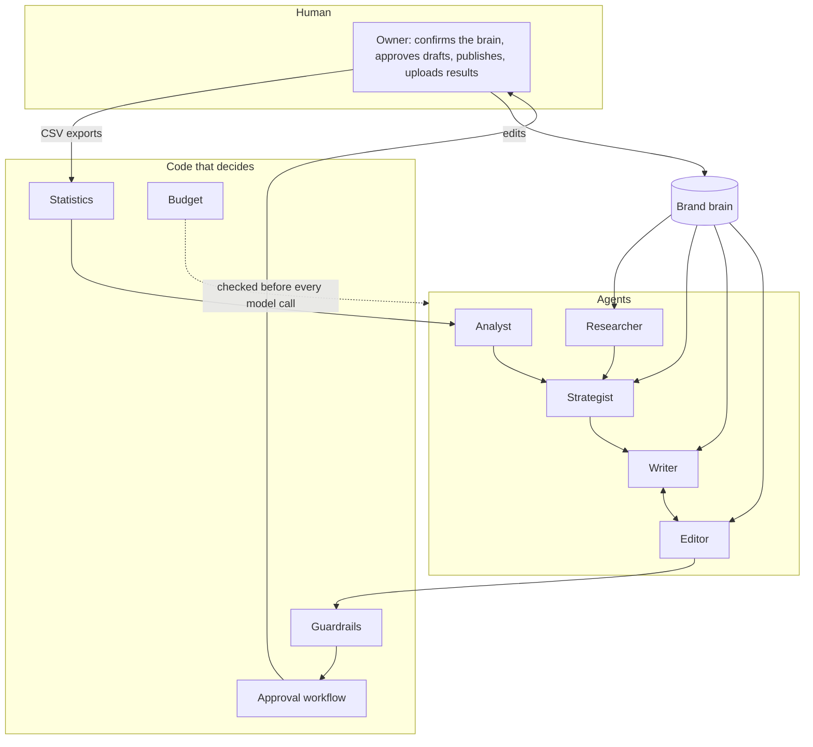

# Architecture

How GrowthCrew is put together: the agents, how data moves between them, and where it is kept.
For the reasons behind the design, see the [case study](case_study.md).

## The shape of it

One rule runs through all of it: **the model writes, and code decides what is allowed
through.** Every agent returns structured output validated against a schema, and each rule that
matters is enforced after the model has answered, not requested in a prompt.

## Agents

All agents call the model through one module, `llm.py`, which retries, validates the output
against a pydantic schema, checks the budget, and logs tokens and cost.

| Agent | Module | Reads | Produces | Rules enforced in code |
|---|---|---|---|---|
| Onboarding | `brain/onboarding.py`, `brain/voice.py` | Up to 20 crawled pages, the owner's questionnaire | The brand brain: business, ideal customer, voice guide, products, proof, competitors | Every field starts `inferred`. Proof is kept only if its quote is verbatim on the cited page. Questionnaire answers override the draft and count as confirmed. |
| Researcher | `agents/research.py` | The brain; the web through three tools (`web_search`, `fetch_page`, `get_reviews`) | `ResearchReport`: competitor teardowns, voice of customer, market signals, a five-point brief | A hard tool-call budget. Claims citing a URL the agent never read are deleted. Quotes must be verbatim; theme frequency is counted from surviving quotes. Three random claims are re-checked against their source in a fresh context. |
| Strategist | `agents/strategist.py`, `frameworks/` | The brain and the research, as a numbered evidence list | `StrategyDoc`: positioning, jobs to be done, messaging house, 90-day channel plan, five experiments, priorities and KPIs | Each recommendation carries evidence IDs; unknown IDs are stripped and unsupported ones listed. ICE scores and ranking are computed. The budget split must total 100. A devil's-advocate call critiques the draft and the strategist revises once. |
| Writer | `agents/content.py`, `content/` | The brain, the strategy, a content request | One piece per request (seven types), or three variants by angle for anything A/B tested | Platform length limits. Only proof from the brain may be quoted. |
| Editor | `agents/critic.py` | The draft, brand voice, proof | Scores on six criteria and line-level edits, for up to three rounds | Banned phrases, length limits and unverified facts cap the relevant score, so the model cannot pass a draft the checks fail. |
| Analyst | `agents/analyst.py`, `analytics/` | Tables computed from uploaded results | `WeeklyLearnings`: what worked, what did not, three proposed changes | The analyst interprets statistics and never computes them. An angle shift without a significant result behind it is blocked. |
| Orchestrator | `agents/orchestrator.py` | Everything above | The weekly cycle | Not a model. A state machine that stops at human approval. |

### The strategist's ruling on proposed changes

Each week the strategist rules on the analyst's three changes. The model gives a view; the
rule in `decide_rulings` has the last word:

- A change backed by a significant A/B test whose winner is the angle being shifted to is
  **accepted by default**.
- If a specific risk is stated (one week of data, an unproven claim in the winning variant),
  it becomes a **partial shift**: half the proposed share, flagged to confirm next week.
- A win seen only across different pieces, not in a controlled test, is always partial.
- A change the statistics do not support is blocked and cannot be accepted.

## The weekly cycle

```mermaid
stateDiagram-v2
    [*] --> research
    research --> strategy_check
    strategy_check --> content_plan: strategy rewritten only on new evidence;<br/>last week's changes ruled on
    content_plan --> drafting: accepted changes applied to the plan
    drafting --> critic: writer and editor loop per piece
    critic --> awaiting_approval
    awaiting_approval --> scheduled: a named person approves, edits or rejects each draft
    scheduled --> published: the owner publishes and confirms
    published --> measured: results uploaded
    measured --> [*]
```

The automated stages run in order and stop at `awaiting_approval`. Everything after it happens
only through `workflow.py`, on behalf of a signed-in person. A cycle halted by an error, a
restart or the budget resumes from the stage it stopped at.

## Data flow

1. **In.** A website URL and a questionnaire become the brain. Each later week, CSV exports
   from LinkedIn, Search Console, GA4, the email tool and the ad platform come in.
2. **Evidence.** The researcher's claims, each with its source URL, and the brain's fields,
   each tagged confirmed or inferred, are numbered into one evidence list
   (`brain:icp.pains`, `learning:2`, `claim:14`, `voc:1`). The strategy cites these IDs.
3. **Content.** A content plan becomes drafts. Each draft carries the pillar it serves, the
   persona, the call to action and the hypothesis it tests, plus a tracking key.
4. **Gate.** Guardrails, then the editor's scores, then a person. Blocked drafts cannot be
   approved, only rejected or edited until clean.
5. **Out.** Approved text is exported (calendar CSV, plain text, `.eml` drafts). Publishing is
   done by the owner and recorded with the live link.
6. **Back.** Uploaded rows are matched to pieces by tracking key, link or opening text.
   `analytics/` computes rates by pillar, angle, format and channel, runs a significance test
   on each experiment, and attaches the uncertainty: the probability each variant is best, a
   95% interval on the lift, and the sample size.
7. **Learn.** The analyst proposes changes, the strategist's ruling is logged, accepted shifts
   alter the next plan, and recurring human edits become brand voice rules.

## Storage

Two places, both local by default.

**Files, under `workspaces/<brand>/`** (git-ignored; one folder per client):

| Path | Contents |
|---|---|
| `brain/vNNNN.json` | The brain. Append-only: every change is a new version. |
| `research/<timestamp>.json`, `-brief.md` | Each research report and its one-page brief |
| `strategy/<timestamp>.json`, `.md`, `.pdf` | Each strategy, with its critique and revision log |
| `content/<timestamp>/` | A batch: every draft, score and revision |
| `learnings/<timestamp>.json` | Each week's learnings |
| `reviews/<source>.csv` | Review exports the owner supplies for sites that forbid scraping |
| `pilot/` | Baseline, weekly log, tracker, reports, testimonial |

**Database** (SQLite via SQLModel; `DATABASE_URL` to change it). Tables are created and new
columns added at startup; there is no migration tool yet.

| Table | Holds |
|---|---|
| `LLMCall` | Every model request: agent, model, tokens, cost, latency, the piece it was for |
| `Cycle`, `Task`, `AgentRun` | Each weekly cycle, its steps, and what each agent spent per step |
| `Draft`, `Approval`, `CalendarItem` | Drafts with their history, each human decision with its diff, and the schedule |
| `ContentRevision`, `GuardrailBlock` | Every editor round and every guardrail block |
| `PerformanceRow` | Normalised rows from uploaded analytics exports |
| `Learnings`, `ChangeDecision` | Weekly learnings and the strategist's ruling on each change |
| `BrainVersion`, `EditPattern` | Which brain fields changed, and edit patterns on their way to becoming voice rules |
| `User`, `WorkspaceBudget`, `RoleModel`, `Alert` | Sign-in and workspace access, spending limits, model choices, alerts |
| `OnboardingJob`, `StrategyComment` | Progress of background work started from the web app |

Fetched pages and search results are cached on disk under `.cache/` for up to a week.

## Interfaces

- **API** (`api/`): FastAPI. Every route requires a signed token and access to the workspace
  involved.
- **Web app** (`web/`): Next.js, talking to the API through a same-origin proxy.
- **Streamlit demo** (`streamlit_app.py`): read-only, sample data.
- **CLI** (`cli.py`): onboarding, research, strategy, content, cycles, users, the pilot.
- **Evals** (`evals/`): the regression suite and scorecard, run in CI.

## What is outside the system

The model (Anthropic API), a search API, and the sites the researcher reads. Fetches go through
one client that refuses private addresses, honours robots.txt, rate-limits per host and caches.
Nothing is sent anywhere else, and nothing is posted to any platform.
