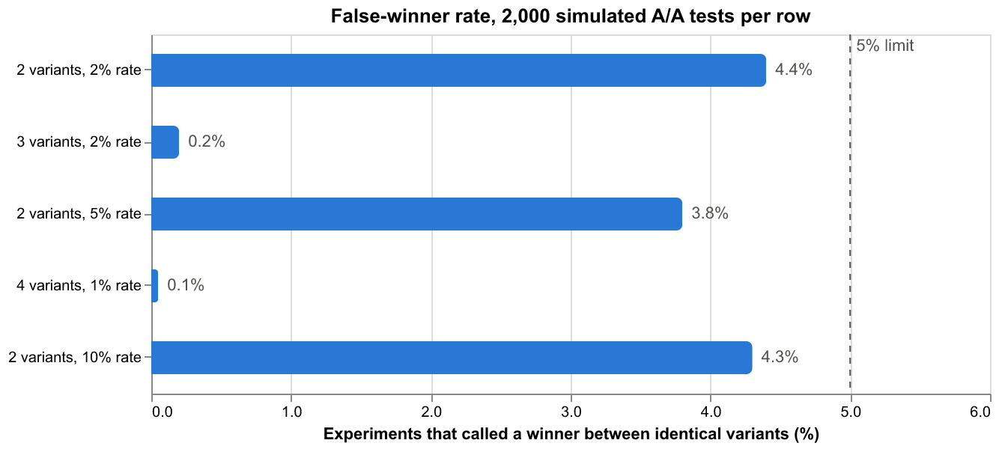
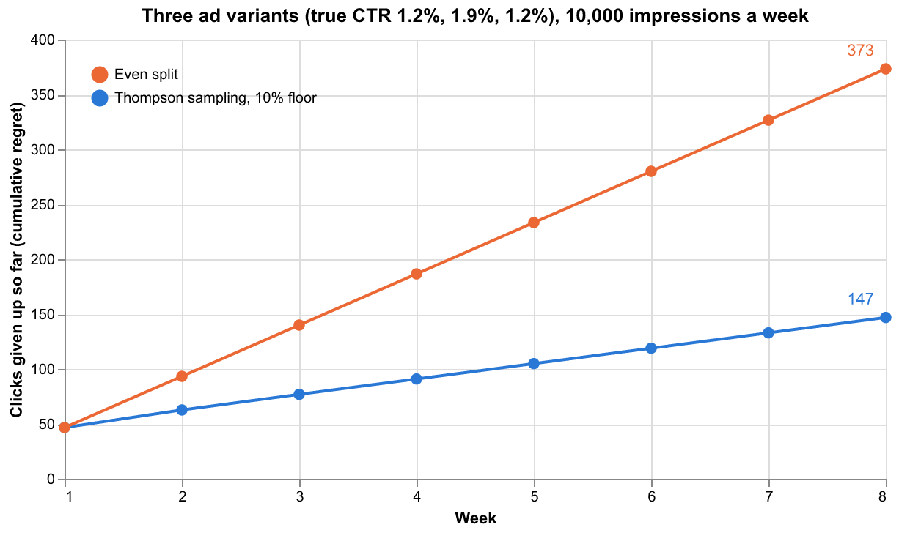

# Experiments

How GrowthCrew decides whether a test has a winner, and why it works the way it does.
The code is in `src/growthcrew/experiments/`, a standalone package (numpy and pydantic only).

## Three ways to read a test, in plain English

Say you run two ad headlines. A gets 100 clicks from 5,000 impressions and B gets 130 from
5,000. Is B better, or did it get lucky?

**Frequentist.** Assume there is no real difference, and ask how surprising your data would
be. If a gap this big would turn up by luck less than 5% of the time, call it "significant".
It answers a question nobody asked ("how odd is this data if nothing is going on?"), it gives
a yes or no with nothing in between, and it is only valid if you decide the sample size in
advance and look once. Peek every day and stop when it looks good, and you will "find" winners
that are not there.

**Bayesian.** Start from what you know (here, nothing), update on the data, and describe what
you now believe about each headline's true rate. That lets you answer the questions a business
owner actually has:

- How likely is it that B is the better one? ("93%")
- How much better, give or take? ("about 30%, somewhere between 0% and 68%")
- If I pick B and I am wrong, what does it cost me? (the expected loss)

It gives degrees of belief instead of a verdict, so you still need a rule for when to act.

**Bandit.** The first two are about learning the answer. A bandit is about earning while you
learn. Each week it moves more budget to whichever variant is probably best, while keeping some
on the others in case it is wrong. You give up less to the losing variants during the test, at
the price of learning a little more slowly about them. It suits ad angles, where traffic costs
money every day; it does not suit a one-off decision like a homepage redesign.

GrowthCrew uses Bayesian analysis to read tests, a bandit to split ad budget while a test
runs, and one frequentist tool: the sample-size formula, to plan how much data a test needs.

## What the engine reports

For every test, and every variant in it:

| Output | Meaning |
|---|---|
| Probability it is best | The chance this variant has the highest true rate |
| Lift, with a 95% interval | How much better than the control or the runner-up, and how uncertain that is |
| Expected loss | What choosing this variant costs on average if it is not the best, as a share of the rate |

Rates (click-through, conversion, reply) use a Beta-Binomial model. Revenue per visitor is
conversion rate times average order value, with the order values resampled (a Bayesian
bootstrap), so one huge order does not masquerade as a reliable difference.

## The decision rule

A winner is called only when **all** of these hold:

1. The test was **pre-registered**, and every variant has reached its planned sample.
2. The leader's **expected loss is under 1%** of its rate (configurable).
3. The leader is **very likely the best**: at least 98% with two variants, 98.7% with three
   (`1 - 0.04 / variants`).

Otherwise:

- Short of the planned sample: **keep running**, with an estimate of how much more is needed.
- Planned sample reached, no clear leader: **no clear difference**. Treat the variants as
  equivalent, or register a new, larger test.

Expected loss alone would not be enough. Between two identical variants the loss of picking
either is tiny, so a loss-only rule would happily "call" one. The probability condition is what
stops that.

Once a test has been judged at its planned sample, **that verdict is final**. The weekly
analysis does not reopen it as more data arrives.

## Pre-registration

Before a test starts, the system stores: the hypothesis, the primary metric, guardrail metrics,
the smallest lift worth detecting, and the planned sample per variant. Variants of an A/B-tested
piece are registered automatically when they are drafted.

The analyst can judge a test only on its registered metric; asking for any other raises an
error. A comparison that was never registered (for example, "posts with the outcome angle did
better than the others") is shown as **descriptive only** and never gets a winner, however
large the gap. That is the difference between testing an idea and finding a pattern in
whatever happened.

## Guardrails

A registered test names metrics the winner must not damage, such as cost per click or
unsubscribe rate. If the winner is probably worse than the control on one by more than the
tolerance (10% by default), the result is flagged. A flagged winner is **held for a person**:
the strategist cannot accept it, and the bandit does not hand it the budget.

## Planning a test

`sample_size(baseline_rate, minimum_detectable_effect)` gives the trials needed per variant.
At a 10% baseline, detecting a 20% relative lift takes 3,839 per variant. Halve the effect you
want to detect and the requirement roughly quadruples, which is why small businesses should
test big differences (a different angle), not small ones (a different adjective).

The baseline comes from the workspace's own history for that content type once it has 1,000
trials; before that it is an assumption set in `config.py`.

## The bandit

`allocate(arms)` gives each variant a share of next week's budget equal to the probability it
is the best (Thompson sampling). While the test is undecided, no variant drops below 10%, so a
slow starter still gets enough traffic to prove itself. Once a clean winner is called, it
takes the whole budget.

## Does it work? Simulations with known answers

`uv run python -m evals.experiments_report` generates synthetic experiments where the true
rates are known, and writes the charts below to `reports/experiments/`.

**False winners.** 2,000 simulated tests per row in which every variant is identical, each
judged once at its planned sample. The worst row called a winner 4.4% of the time.

**Real differences.** With a true lift equal to the smallest one planned for, the right winner
was called in about 76 to 78% of 1,000 tests, and the wrong one in none. That is a little under
the 80% the sample-size formula promises, because the rule here is stricter than a plain
significance test.

**Bandit against an even split.** Three ad variants with true click-through of 1.2%, 1.9% and
1.2%, 10,000 impressions a week for eight weeks, averaged over 300 runs. The even split gave up
373 clicks to the weaker variants; Thompson allocation gave up 147, or 61% fewer.

## Limits

- One look. The rule is validated for a single judgement at the planned sample. It is not a
  sequential test, so it cannot stop a test early on overwhelming evidence. That matters
  most for low-traffic B2B tests; sequential stopping is on the [roadmap](roadmap.md).
- The bandit assumes rates do not drift. If an ad fatigues, last month's winner may no longer
  be the best, and nothing here detects that.
- Guardrails compare the winner with the control only.
- Revenue analysis exists in the package but nothing feeds it yet: no export carries order
  values.
- The simulations show the engine behaves as designed on synthetic data. They say nothing
  about whether a real audience behaves like a coin flip.
