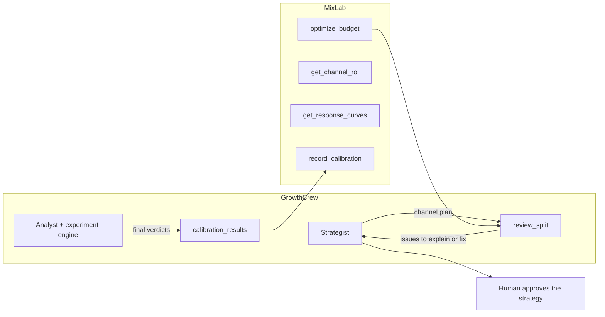

# GrowthCrew and MixLab

MixLab is a separate marketing-mix model. GrowthCrew decides *what* to say and tests it;
MixLab estimates *where* money works. They talk over MCP.

- **Budget split.** `integrations/mixlab.py` asks `optimize_budget` for a split with a 95%
  interval per channel. When the strategist is given a MixLab client and a budget, any planned
  share outside the interval becomes an issue in the revision step and on the StrategyDoc. The
  strategist explains or fixes it; nothing is moved in code, and a person approves the result.
- **Calibration.** Only final, pre-registered verdicts (with their lift interval and sample
  size) are sent back. Descriptive comparisons are never sent.
- **Demo.** MixLab's own repository is not part of this one, so `SyntheticMixLab` stands in
  with made-up response curves: `uv run python -m evals.mixlab_demo`. Its output is labelled
  synthetic and is not a client result.
